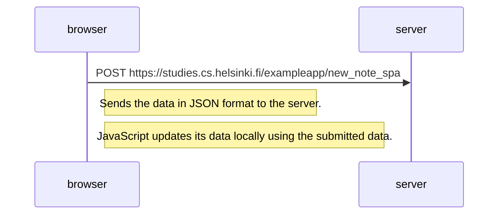

# Exercise 0.6 - Single Page Diagram when sending a note
In this situation, when the data is sent/saved, the single page does not request the updated SERVER data, data added to the server in the time between loading the page and saving the user data does load to the brower as there is no server GET request. 

