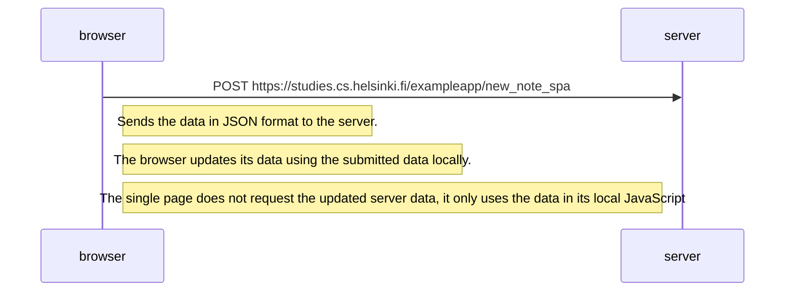

# Exercise 0.6 - Single Page Diagram when sending a note

```mermaid
sequenceDiagram
    participant browser
    participant server

    browser->>server: POST https://studies.cs.helsinki.fi/exampleapp/new_note_spa

    Note right of browser: Sends the data in JSON format to the server.

    Note right of browser: The browser updates its data using the submitted data locally.
    Note right of browser: The single page does not request the updated server data, it only uses the data in its local JavaScript
 


```

