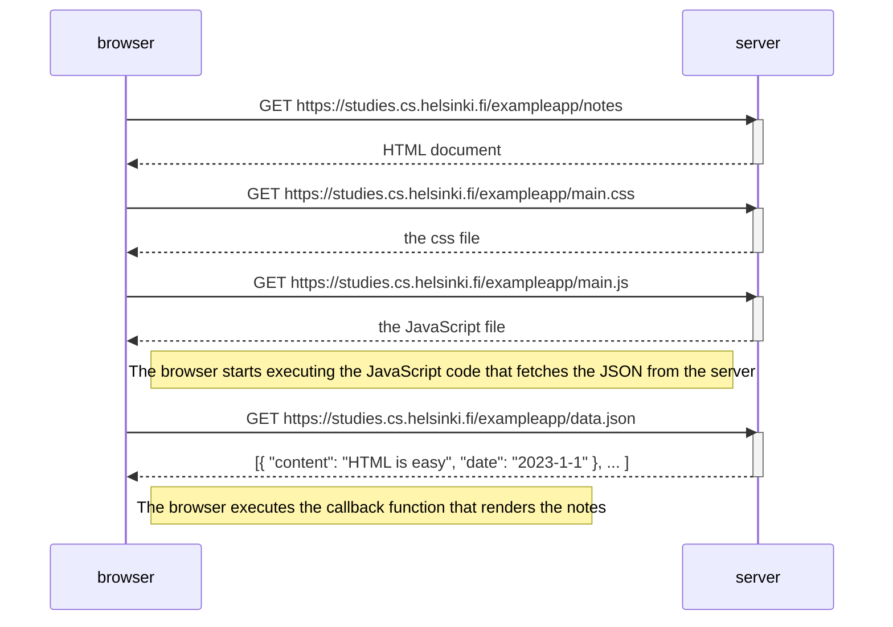

# Exercise 0.4 - New Note Diagram
This shows the exchange between the browser and server when a new note is created from this webiste:
https://studies.cs.helsinki.fi/exampleapp/notes

In this situation the website is already loaded, and the following shows what happens when a new note is added.

